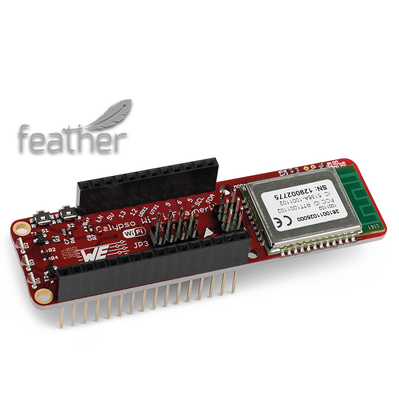
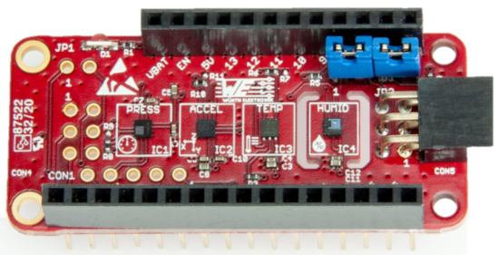

#  How to create an demo IoT application using the Calypso IoT design kit?
This guide will take you through the process of unboxing the Calypso IoT design kit, configuring it and finally sending sensor data to the IoT platform of your choice.

This is a quick start guide intended to get the kit operational in quick time.

## **Prerequisites**
In order to go through this process you will need the following.

### **Hardware**

- The design kit with M0 Feather stacked with Calypso Wi-Fi FeatherWing, the Sensor FeatherWing and the OLED FeatherWing.

- A Micro-USB cable to power up the design kit stack.

- A Wi-Fi access point (IEEE 802.11 b/g/n compatible) with internet access.

- A Wi-Fi enabled computer with a browser (Chrome or edge recommended).

### **Software**
- (Optional) If you intend to follow the examples and use AWS IoT core, Azure IoT hub or KaaIoT, you will need to have the corresponding accounts and credentials.

- The WE certificate generator tool. This can be downloaded from:
https://www.we-online.com/certificategenerator

> [!WARNING] 
> This tool works only on Windows platform. This tool may require installation or update of dotnet runtime. If this is not already installed, please [download](https://dotnet.microsoft.com/en-us/download/dotnet/thank-you/runtime-desktop-8.0.16-windows-x64-installer) and install this package.

> [!WARNING] 
> The design kit will always be delivered with the latest Firmware version (> v2.2.0). 
In case you use a Calypso FeatherWing which you received separately, make sure that the Calypso FeatherWing has a Firmware version > v2.2.0 [(More Info).](https://www.we-online.com/components/products/manual/UM_Calypso_261001102500x%20(rev2.5).pdf) 

## **Unboxing the Calypso IoT design Kit**

The Calypso IoT design kit consists of the following parts:

1. 1x Calypso FeatherWing
2. 1x Sensor FeatherWing
3. 1x Adafruit Feather M0 experess
4. 1x Adafruit Feather OLED
5. 1x USB A to micro-USB cable

### **Calypso FeatherWing**

The Würth Elektronik eiSos [Calypso FeatherWing](https://www.we-online.com/en/components/products/CALYPSO_FEATHERWING_2) is a development board that offers a secure 2.4 GHz WiFi connectivity solution. It is fully compatible to the popular Adafruit Feather line of development boards and extends the Feathers with WiFi connectivity.

The Calypso FeatherWing consists of the Calypso radio module that offers WiFi connectivity based on IEEE 802.11 b/g/n with a fully featured TCP/IP (IPv4 and IPv6) stack. With out-of-the-box support to commonly used network applications like SNTP, HTTP(S), MQTT(S) Calypso offers an easy and  secure solution to any IoT application.

Further details about the Calypso WiFi module can be found under [we-online.de/katalog/en/Calypso](https://www.we-online.com/en/components/products/CALYPSO).

### **Sensor FeatherWing**

The Würth Elektronik eiSos [Sensor FeatherWing](https://www.we-online.de/katalog/en/SENSOR_FeatherWing) is a sensor development board fully compatible to the popular [Adafruit](https://www.adafruit.com/) [Feather line](https://www.adafruit.com/feather) of development boards. It integrates the following four sensors:

* [**WSEN-PADS**](https://www.we-online.de/katalog/en/WSEN-PADS) - Absolute pressure sensor [(2511020213301)](https://www.we-online.de/katalog/datasheet/2511020213301.pdf)
* [**WSEN-ITDS**](https://www.we-online.de/katalog/en/WSEN-ITDS) - 3-axis acceleration sensor [(2533020201601)](https://www.we-online.de/katalog/datasheet/2533020201601_valid_from_2020-12-14.pdf)
* [**WSEN-TIDS**](https://www.we-online.de/katalog/en/WSEN-TIDS) - Temperature sensor [(2521020222501)](https://www.we-online.de/katalog/datasheet/2521020222501.pdf)
* [**WSEN-HIDS**](https://www.we-online.de/katalog/en/WSEN-HIDS) - Humidity sensor [(2525020210002)](https://www.we-online.de/katalog/datasheet/2525020210002.pdf)

All four sensors are connected over the shared I2C bus and hence can be connected to any of the Feather microcontroller boards. The available C/C++ drivers and examples make it easy to build a prototype to kick-start the application development.

The Sensor FeatherWing also has a [4-pin JST QWIIC®](https://www.sparkfun.com/products/16766) connector on-board. This enables easy connection to SparkFun's [QWIIC® ecosystem](https://www.sparkfun.com/qwiic) of development boards. Additionally, a **6 pin connector** enables the extension of the FeatherWing with a host of [**evaluation boards from Würth Elektronik eiSos**](https://www.we-online.de/catalog/de/wco/wireless-connectivity_1/eval_boards).

### **Adafruit Feather M0 Express**

The [Adafruit Feather M0 express](https://www.adafruit.com/product/3403) is built around the ATSAMD21G18 ARM Cortex M0+ processor, clocked at 48 MHz and at 3.3 V logic, the same one used in the new Arduino Zero. This chip has 256K of FLASH and 32K of RAM and comes with built-in USB so that it has USB-to-Serial program and debug capability built in with no need for an FTDI-like chip. It comes with a Mini NeoPixel, 2 MB SPI Flash storage, and can be powered using a Li-Po battery.

The MCU on this board is pre-flashed with firmware that configures the sensors and the wireless module. It performs all the necessary steps to provision and connect to the IoT central platform. Once the connection is established, the sensor data is read periodically and sent to the cloud.

### **Adafruit FeatherWing OLED**

The [Adafruit FeatherWing OLED](https://www.adafruit.com/product/4650) is a 128X64 pixel monochrome OLED display in the feather form factor. Using the Feather pin header, this board adds a display and three user buttons to any Feather main board.

These displays are small, only about 1.3" diagonal, but very readable due to the high contrast of an OLED display. This screen is made of 128x64 individual white OLED pixels and because the display makes its own light, no backlight is required. This reduces the power required to
run the OLED and is why the display has such high contrast. The three mini tactile buttons as well as the reset button along with the display add a miniature user interface to the Feather.

The OLED uses only the two I2C pins on the Feather, and you can pretty much stack it with any other FeatherWing, even ones that use I2C since that is a shared bus.

## **Quick start guide**
This section will guide you through the process of creating an end-to-end IoT solution. 
Follow the instructions in the links below to connect your kit to the platform of your choice.

- [**Eclipse Mosquitto broker**](mosquitto.md)
- [**AWS IoT core**](aws.md)
- [**Azure IoT Central**](azure.md)
- [**KaaIoT**](kaa.md)

