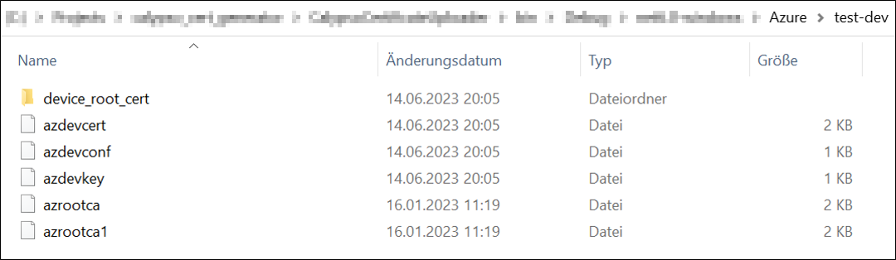

#  How to create an end-to-end IoT application using the Calypso IoT design kit and Azure IoT Central

The Calypso IoT design kit comes pre-flashed and is ready-to-use out-of-the box. The following items are necessary to go through this process.

- The design kit with M0 Feather stacked with Calypso Wi-Fi FeatherWing, the Sensor FeatherWing and the OLED FeatherWing.

- A Micro-USB cable to power up the design kit stack.

- An IEEE 802.11 b/g/n compatible access point with internet access.

- A Wi-Fi enabled Windows computer with a browser (Chromium based browser recommended).

- A Microsoft Azure account. This can be created under the following link:
https://azure.microsoft.com/en-us/free/

- The WE certificate generator tool. This can be downloaded from:
https://www.we-online.com/certificategenerator

:warning: Make sure that the Calypso FeatherWing has a Firmware version > v2.2.0. In case of older firmware version, upate the Calypso module Firmware.

## Quick start guide

The brief description of the steps to be followed to setup the Calypso IoT plug and play design module are summarized below:


**1. Create an IoT Central Application –** Sign in to Azure portal, and in IoT Central Application, on the Basics tab, complete the required fields and wait for the deployment of a new application on IoT central platform

**2.	Create Certificates on WE certificate generator tool –** Install the WE certificate generator tool and  configure the device and create device root certificate, device certificate & device private key. Then export all the files

**3.	Upload Root Certificate to IoT Central –** Once a new enrollment group is created, the root certificate in .pem format needs to be added to the group.

**4.	Import IoT design kit into application -** The device template published for the Calypso IoT design kit in Microsoft’s list of Plug and Play devices can be used, or any other template. After this, the IoT platform is ready to authenticate and automatically detect the devices of type "Calypso IoT design kit"

**5.	 Configure the device –** A one-time configuration of the kit is done which enables connection to the desired Wi-Fi network and the previously created IoT central application. Connect to calypso device in access point mode and navigate to calypso.net/azure.html. There, upload the certificates created in the WE Certificate Generator tool.

**6. View Device Dashboard on IoT Platform -** Access the device on the IoT platform and verify the telemetry data

### Create an IoT central application

 - a.	Sign in to the Azure portal, https://portal.azure.com/

 - b.	 From the Azure homepage, select the "+ Create a resource button" and then enter "IoT Central application" in the Search the Marketplace field. 

 - c.	Select "IoT Central application" from the search results and the select "Create".


On the Basics tab, complete the fields as follows: 

 - a. **Subscription**: Select the subscription to use for the application.

 - b.	**Resource group:** Select a resource group or create a new one. To create a new one, select Create new and fill in the name you want to use. To use an existing re source group, select that resource group. For more information, see Manage Azure Resource Manager resource groups.

 - c.	**Resource name**: Type in a name for the IoT central application.

 - d.	**Application URL**: This will be automatically set to (azureiotcentral.com)

 - e.	**Template**: From the drop down, select "Custom application".

 - f.	**Region**: Select the region in which the application will be located. Select a location that is geographically the closest.

 - g.	**Pricing Plan**: Choose the appropriate pricing tier. The standard tier 0 is good to start prototyping. More details on pricing can be found at, https://azure.microsoft.com/en-us/pricing/details/iot-central
  
 - h.	Click on **"Review + Create"**. 
  


 - i.	On the following page, review the terms and click on **"Create"**. 
  
 - j.	Wait for the deployment to complete. After the process is complete, click on "Go to resource" button to open the application. 
 
 
  
 - k.	Click on the IoT central application URL to open the newly created IoT central platform.
 
  
  
 - l.	In the IoT central app open, "Permissions > Device connection groups" and note down the ID scope parameter for use in further steps.


### Create certificates

In order to securely connect the device to IoT central application, the device needs to implement certain methods for authentication. In this case, the X.509 certificate based authentication is implemented. This method requires creation of certificates for every device. In order to enable easy prototyping, Würth Elektronik eiSos’s Certificate creation tool can be used. This tool creates all the certificates necessary to get started.

- 	Download the WE certificate generator tool from https://www.we-online.com/certificategenerator 

- 	Unzip to a suitable location on the computer and open the executable ```WECertificateUploader.exe```

Inside the WE Certificate Generator tool, fill in the following fields to generate the required certificates for the cloud service

1.	SSID, SSID Password : Select your Wi-Fi SSID and its password for uploading to the calypso module

2.	Security: Select the appropriate type of Security used in the Wi-Fi

3.	Device ID: This is the name of the device as it appears in the IoT central APP. It needs to be unique per device. 

4.	Scope ID: Type in the ID scope noted in the previous section. ID scope is unique per application but common across devices.

5.	NTP server: Enter the time server of choice that the module will use to get the current time.

6.	Time zone: Select the appropriate time zone.


####	Device root certificate:
This is the self-signed certificate that acts as the root of trust for all devices. The device root certificate is used to generate leaf certificates. Each device has a unique leaf certificate that identifies the device. The root certificate can be generated once and used for generating leaf certificates for several devices. This tool allows creation of a new root certificate, saving the same and loading it back for subsequent usage. 
1. On first time use, set the validity time in months 

2. Click on "Create root certificate" to create a new root certificate. 

3. If a root certificate already exists, click on "Load root certificate". This opens a file browser. Browse to the correct location to choose the previously used root certificate. Use .pfx format certificate for loading.
  
4. Click on "Save root certificate" to save the generated root certificate for future use. This can be used generate the certificate in .pfx format which is the format  used during loading a certificate.

5. Click on "Export root PEM" to export the certificate in PEM format. This file needs to be uploaded to the IoT central application

6. Click on "Display root certificate" to view the certificate in the standard Windows format.


####	Device certificate:
Every device requires a unique device certificate to securely connect to the IoT central application. Each device certificate generated is exclusively linked to the device through the device ID and cannot be used on any other device. 
1. For every device ID, set the validity time in months. 
2. Click on "Create device certificate" to create a new device certificate
3. Click on "Export device PEM" to export the certificate in PEM format. This file needs to be uploaded to the device.  
4. Click on "Display device certificate" to view the certificate in the standard Windows format.


####	Device private key:
This is the private key corresponding to the public key in the device certificate and is also uniquely linked to a device ID. Click on "Export device key" to export the key in PEM format. This file needs to be uploaded to the device as will be explained in the subsequent sections.
 

After completing the processes of generating the root and device certificates, export all the files by clicking "Export All Files". All the certificate files will be created and stored under "Azure" folder inside the main directory.
       


#### Certificates Generated in the output directory:
After exporting all the necessary files, a new directory will be created in the same folder as the executable file with all the necessary configuration file and certificates.
   
  
### Upload the Root certificate to IoT central
    
In this step, the device root certificate is uploaded and a policy is set to allow all devices with leaf certificate that are generated from this root to be allowed to connect to the platform.
    
  - In the IoT central app open, "Permissions > Device connection groups" and click on "+New"
  
  
  
  - In the subsequent window,
    * a. Enter a name for the enrollment group.
    * b. Set the "Automatically connect devices in this group" to true.
    * c. Set the group type to "IoT devices"  
    * d. Set the attestation type to "Certificates (X.509)"
    * e. Click on "Save".
    


- Once the enrollment group is created, the root certificate needs to be added to this group.
In order to do this,
  * a. Click on "Manage primary" in the "Certificates (X.509)" section of the enrollment group.
  * b. In the pop-up window, click on "Add certificate" and select the device root file generated using the WE certificate generator.
  * c. Set the "Set certificate status to verified on upload" option to true.
  * d. Click on "Upload"
  * e. On completion of the upload process, close the pop-up window.
  


### Import the Calypso IoT design kit profile into your application

The device template for the Calypso IoT design kit is published in the Microsoft’s list of Plug and Play devices. This template needs to be imported to this IoT central application to enable automatic device and data detection. This can be done using the following steps.
   
- Select the "Device templates" option in the main menu and click on "New".  


   
- In the subsequent window, scroll down the list of all available devices to find "Calypso IoT design kit". Select this and click on "Review".
      

   
- Add the device by clicking on "Create" button.
  

   
At this stage, the IoT platform is ready to authenticate and automatically detect the devices of type "Calypso IoT design kit"       

### Configure the device
          
The IoT design kit comes with the Firmware pre-installed. In this step, a one-time configuration of the kit is done which enables connection to the desired Wi-Fi network and the previously created IoT central application
          
- Ensure that all the four boards are stacked up correctly with the Adafruit FeatherWing OLED on the top.
          
- Power up the IoT design kit stack via USB or a Li-Po connector on the Adafruit M0 Feather board.
          

            
 - After a short initialization process, the device waits for the user to start the configuration process. The following message appears on the display "Device not configured. To configure double press button C".
            
- Double press button C on the OLED display FeatherWing to enter the configuration mode.


              
- In the configuration mode, perform the following five steps,

  - a. In the configuration mode, the Calypso Wi-Fi module is set to access point mode with an SSID "calypso_<MAC_ADDRESS>". Connect your PC (Laptop/tablet/smartphone) to this access point, displayed on the screen.


   - b. On the PC open a browser.
              
   - c. In the browser, navigate to calypso.net/azure.html.                     
  

   - d. Click on the "Choose Files" button. This opens the file browser. Browse to the location where the configuration files were generated as described in the previous section. The files are stored under the path "working directory > Azure > <Device ID>". Select all the files in the directory and click on "Upload" button. On success, the message "Success: 204 No content" at the bottom of the page indicates successful configuration of the device.
              

 
   - e. Restart the device by clicking the "Reset" button.
              

                  
 - On restarting, the device goes through the following steps automatically,
              
    - a. Initialize the hardware.
              
    - b. Connect to the configured Wi-Fi network.
              
    - c. Connect to the Microsoft Azure Device provisioning service (DPS).
              
    - d. After authentication, the DPS assigns the address of the IoT hub (Device management service of Azure) to connect.
              
    - e. This address is saved in the secure storage of the Calypso Wi-Fi module for further use.
              
    - f. Finally, the device connects securely to the IoT central platform and starts exchange of data.
              
At this stage, the device is fully configured, securely connected and ready to use. On subsequent boot-up the device directly connects to the platform using the saved address and starts exchanging data with the platform.
             
  

### View the device default dashboard

To access the device on the IoT platform, navigate to "Devices -> All devices -> <Device ID>".
  
Click on the device name to open the device page.
  


In the "about" tab, the properties are displayed.
  

  
The telemetry data is displayed graphically in the "Overview" tab.
  

 
### Send commands to device
  
In order to send a command to change the mini neo-pixel LED on the device, click on the command tab on the device page. Enter the RGB values and click on Run. The message is processed by the device and the colour of the LED is changed accordingly.
  

    
 **Update device property:**  
This device allows changing the frequency with which the sensor data is read and sent to the platform. This can be done from the IoT central platform. To do so, open click on "Manage device drop down and select "Device properties". This opens the property update page.


  
To update the send frequency, type in ""telemetrySendFrequency": "<Send frequency in seconds>" and click on "Send to device". This updates the device's send frequency on the device.


### Factory resetting the device

In order to reset the device to factory state, press the "button C" once, then Press and hold "button C" till the following message is displayed on the screen, "Reset device to factory state". 
This procedure resets the device to default state. Follow the device configuration process defined earlier to reconfigure the device.