#  How to create an demo IoT application using the Calypso IoT design kit with KaaIoT?
## **Prerequisites**
The IoT design kit comes with the Firmware pre-installed only for the Azure platform. To enable the possiblility to connect to the KaaIoT platform the fiwmware has to be updated to the latest from this repository. The following items are necessary to go through this process and connecting to the KaaIoT platform.

- The design kit with M0 Feather stacked with Calypso Wi-Fi FeatherWing, the Sensor FeatherWing and the OLED FeatherWing.

- A Micro-USB cable to power up the design kit stack.

- A Wi-Fi access point (IEEE 802.11 b/g/n compatible) with internet access.

- A Wi-Fi enabled computer with a browser (Chrome or edge recommended).

- A KaaIoT account. This can be created under the following link:
https://www.kaaiot.com/free-trial

:warning: The design kit will always be delivered with the latest Firmware version (> v2.2.0). 
In case you use a Calypso FeatherWing which you received separately, make sure that the Calypso FeatherWing has a Firmware version > v2.2.0 [(More Info).](https://www.we-online.com/components/products/manual/2610011025000_Calypso%20261001102500x%20Manual_rev2.0.pdf#page128) 

## **Quick start guide**
This section will guide you through the process of creating an end-to-end IoT solution. This process involves the following 5 steps at the end of which you should be able to see the telemetry data from the device on the cloud platform.

 Each of these steps are described in detail in the subsequent sections.

[**1. Create a KaaIoT Application and Endpoint:**](#creating-an-kaaiot-application) In this step, we create an KaaIoT Application and Endpoint.

[**2.	Get TLS certificates and private key:**](#download-certificates-from-kaaiot) In this step, the root certificate.

[**3.	Configure the device:**](#configure-the-device) This step fully configures the device to connect to cloud.

[**4. View and interact with device on the KaaIoT platform:**](#view-the-device-telemetry) View device information, telemetry and [interact](#send-commands-to-device) with the device from the cloud platform.

## **Creating a KaaIoT application and endpoint**

 a.	Sign in to the [KaaIoT](https://cloud.kaaiot.com/).
 If a subscription does not exit, please create an account by the [link](https://www.kaaiot.com/free-trial).

 b. From the [Device management](https://cloud.kaaiot.com/devices/device-management) page, select the "Applications" and press "Add application" (name it "Wurth application"). 
 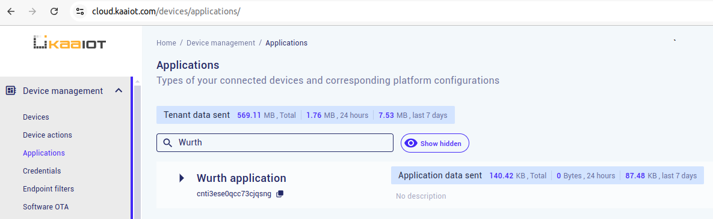

:information_source: On the next step the Endpoint will be created. But on that step we will need the token for the Endpoint creation. As usual something unique like device serial number, imei is used as a token. For the simplicity the "calypso-token" will be used as a token.

 c.	From the [Device management](https://cloud.kaaiot.com/devices/device-management) page, select the "Devices", select our new application and press "Add device". 
 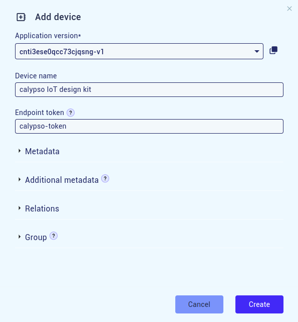

## **Get TLS certificates and private key**

In order to securely connect the device to IoT central application, the device needs Root CA certificate, device private key and device certificate. Device private key and device certificate are optional. To get the certificates and private key go to the [Credentials](https://cloud.kaaiot.com/devices/credentials/certificates) page. 

"Get root certificate" button allows to see the Root CA. Save this certificate to file with name "kaarootca". 

"Add TLS client certificate" button allows to create the device private key (save to file with name "kaadevkey") and certificate (save to file with name "kaadevcert"). For the simplicity we will connect with only Root CA file.
    
## **Configure the device**
          
The IoT design kit comes with the Firmware pre-installed only for the Azure platform. To enable the possiblility to connect to the KaaIoT platform the fiwmware has to be updated to the latest from this repository. 

In this step, the device will be configured to be able to connect to the KaaIoT
          
- Ensure that all the four boards are stacked up correctly with the Adafruit FeatherWing OLED on the top.
          
- Power up the IoT design kit stack via USB or a Li-Po connector on the Adafruit M0 Feather board.
          

- Compile and upload the latest firmware to the IOT design kit. For example via Visual Studio Code and Platform IO. Restart the device.

- After a short initialization process, the device checks the existence if **platform.json** file, that contains the information about selected platform (because after the update the device supports 2 IOT platforms: Azure and KaaIoT). File doesn't not exist and it is created with default platform KaaIoT. 

  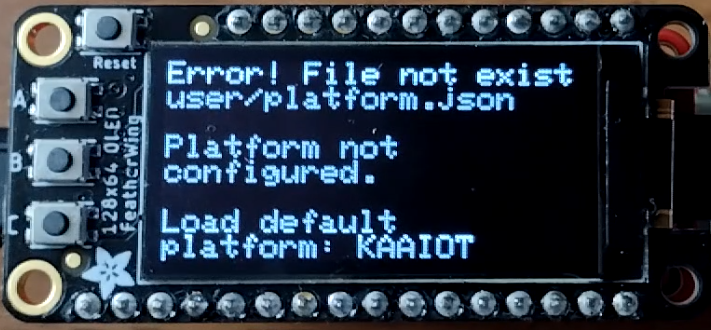

- Next the device looks for KaaIoT config file **kaadevconf.json**. This file also is absent during the first start and will be created later during the device configuration.

  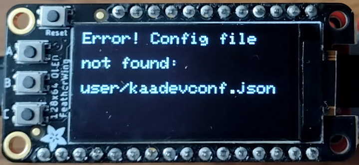

- The device configuration will be through the web interface. The main web menu file is index.html. To add the KaaIoT platform this file will be overwritten and orignal file will be created as index_src.html to backup it.

  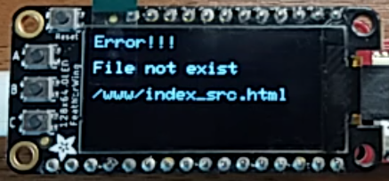 

  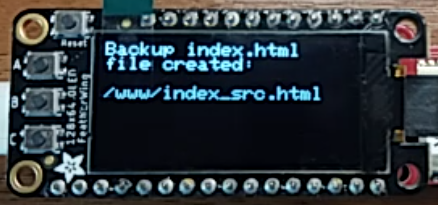

- After that device informs that the IoT platform not configured and is waiting for the user to start the configuration process. 

  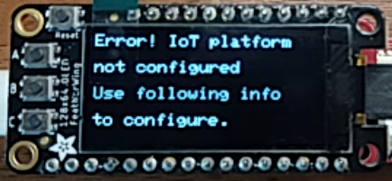

- Next the following message appears on the display "Device not configured. To configure double press button C". To switch platform long press on button B (the platform.json file will be changed and after the restart the device starts with another platform selected).
            
- Double press button C on the OLED display FeatherWing to enter the configuration mode.

  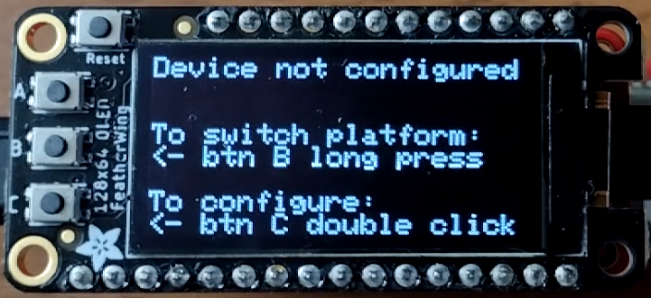        
              
- In the configuration mode, perform the following five steps,

  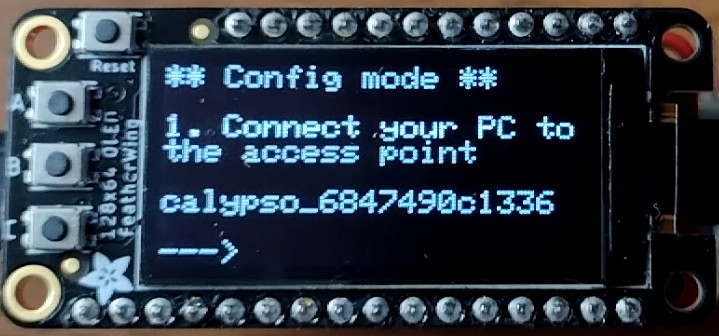
  
  a. In the configuration mode, the Calypso Wi-Fi module is set to access point mode with an SSID "calypso_<MAC_ADDRESS>" and password "calypsowlan". Connect your PC (Laptop/tablet/smartphone) to this access point, displayed on the screen.

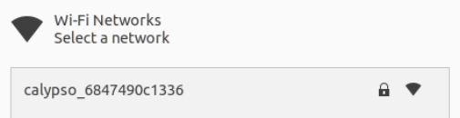  

  b. On the PC open a browser.
              
  c. In the browser, navigate to [calypso.net](calypso.net). Press on the left menu.                     

  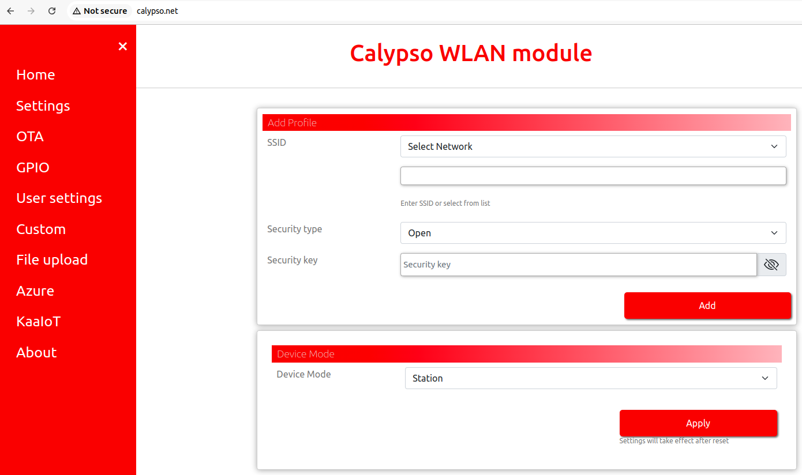

  d. Press on the KaaIoT. There is the main menu. Also this page accessible directly on [calypso.net/kaaiot.html](http://calypso.net/kaaiot.html).

  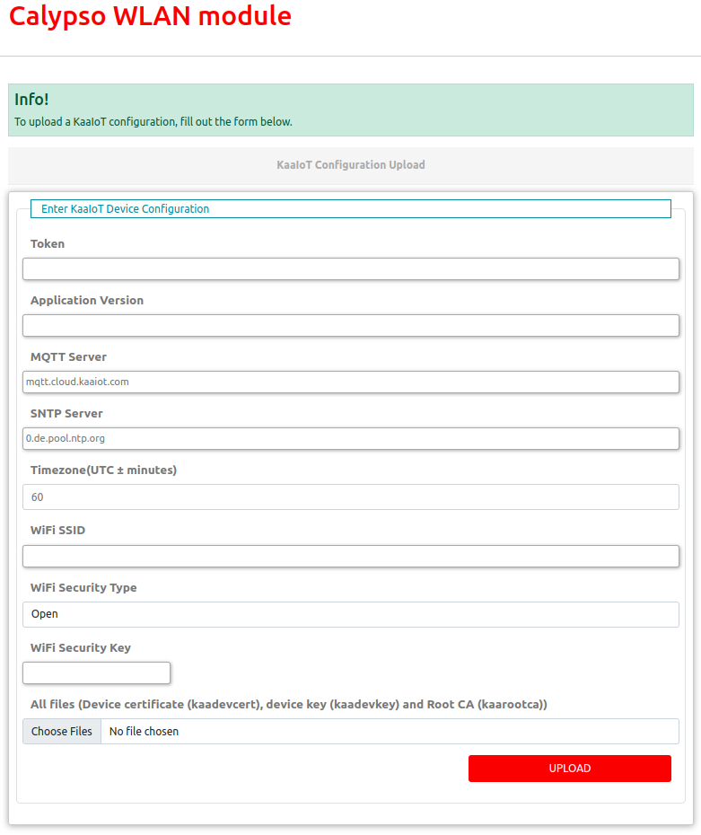 

  e. Fill the fields. Click on the "Choose Files" button. This opens the file browser. Browse to the location where the configuration files are. Select Root CA file (kaarootca). Click on "Upload" button. It uploads the configuration and files. 

  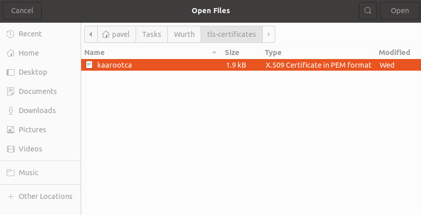

  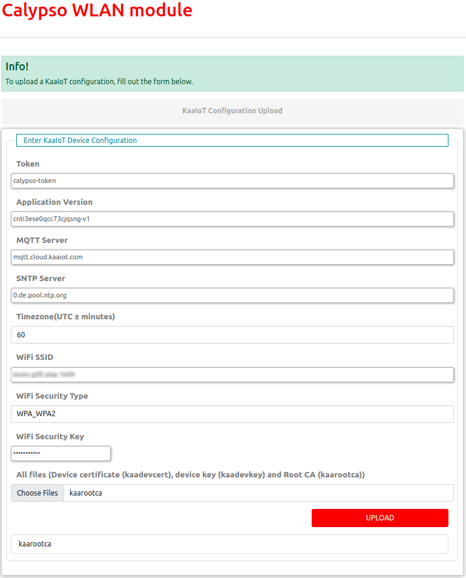

  f. On success, the message "Success: 204 No content" at the bottom of the page indicates successful configuration of the device.

  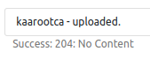
 
  g. Restart the device by clicking the "Reset" button.
              
  
                  
- On restarting, the device goes through the following steps automatically,
              
  a. Initialize the hardware.

  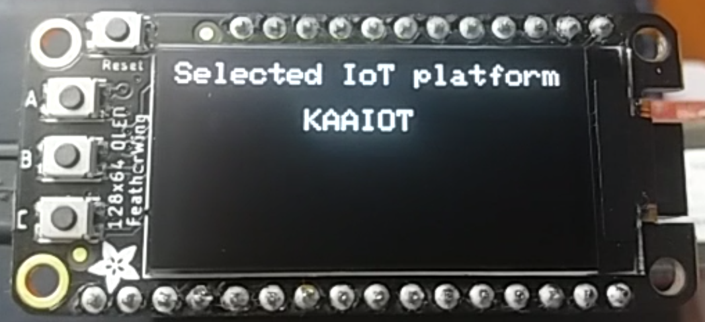
  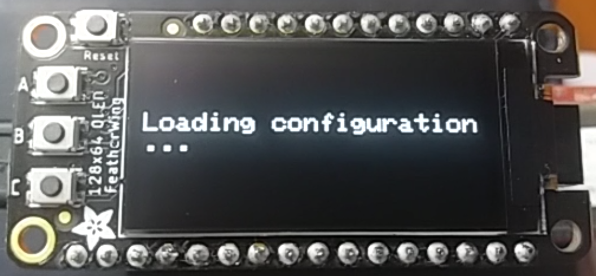

  When only Root CA is used the device informs about the absence of device certificate and device private key.

  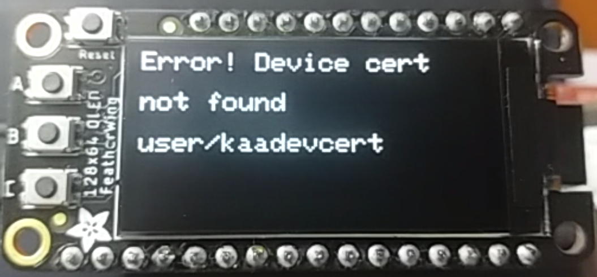
  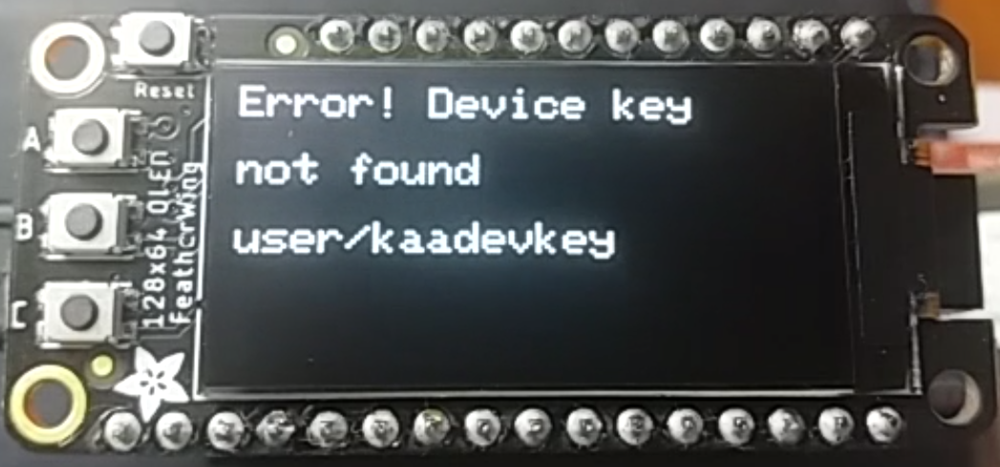
              
  b. Connect to the configured Wi-Fi network.

  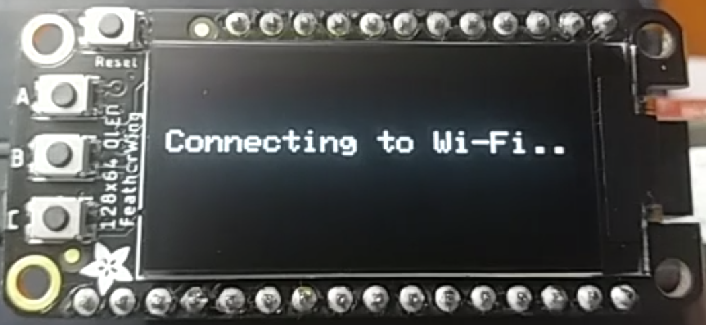

  c. Synchronize date and time with SNTP server.

  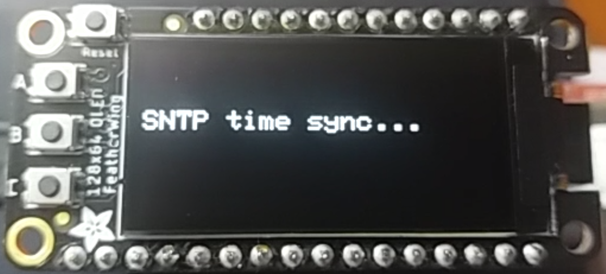
              
  d. The device connects securely to the KaaIoT platform and starts exchange of data.

  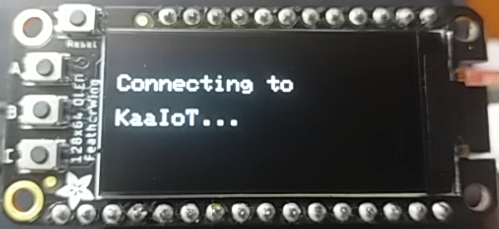
  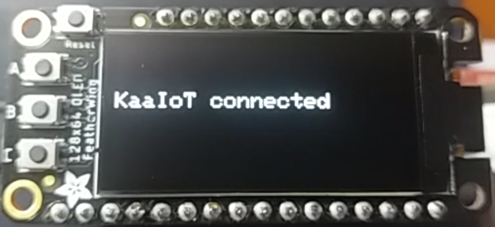
              
At this stage, the device is fully configured, securely connected and ready to use. On subsequent boot-up the device directly connects to the platform using the saved address and starts exchanging data with the platform.
             
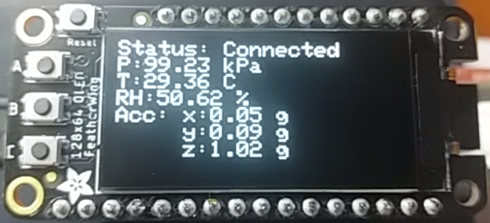             

Connect the PC to the Internet by reconnect to the your local Wi-Fi network.

**Congratulations!** The set-up is now complete. It's not time to check the telemetry data on the cloud.

## **View and interact with device on the KaaIoT platform**

To access the device on the KaaIoT platform, navigate to "Devices -> Wurth application -> <Endpoint ID>".

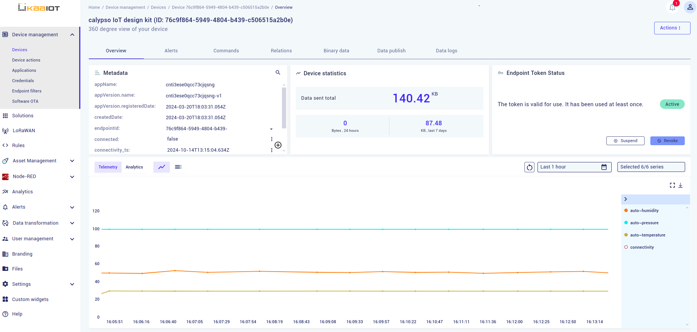
 
## **Send commands to device**
  
In order to send a command to the device, click on the commands tab on the device page. Enter command type *switch_on_off* and enter the command body *{"state":"on"}*

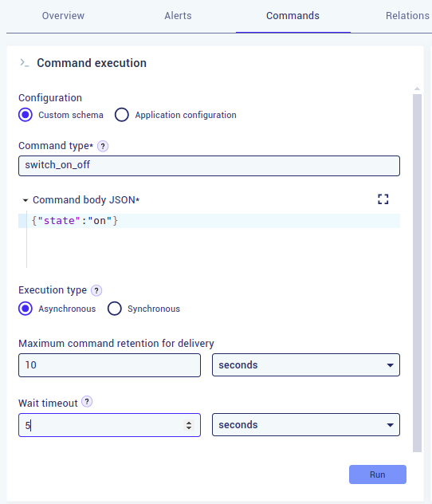

Click on Run. 

The message is processed by the device, the device show the command state on the display and send response.
  
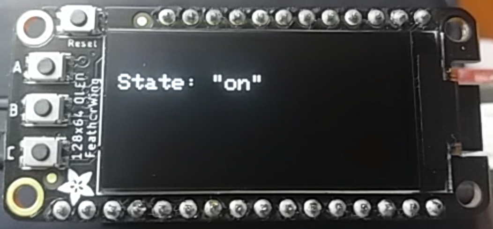  

KaaIoT platform show that command was executed.

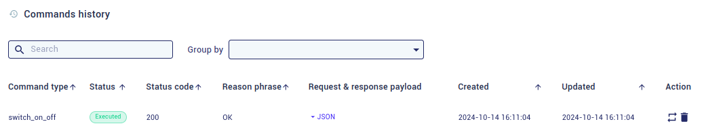

## **Factory resetting the device**

In order to reset the device to factory state, press the "button C" once, then Press and hold "button C" till the following message is displayed on the screen, "Reset device to factory state". 
This procedure resets the device to default state. Follow the device configuration process defined earlier to reconfigure the device.