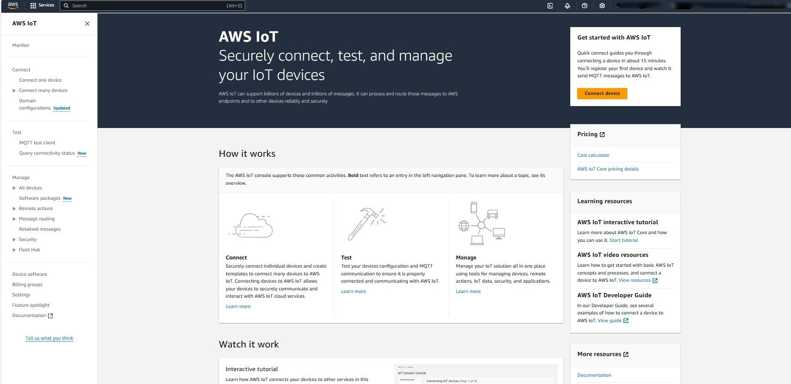
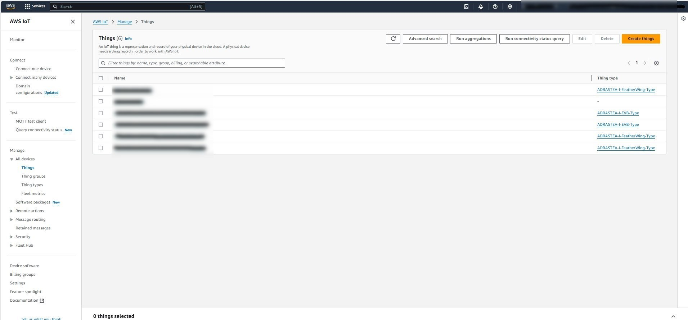
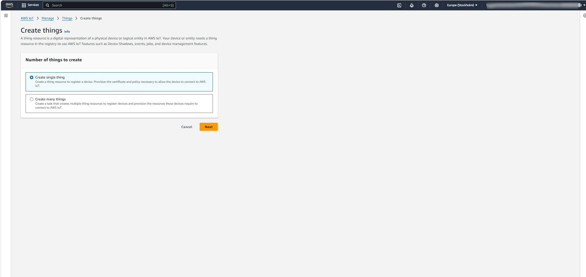
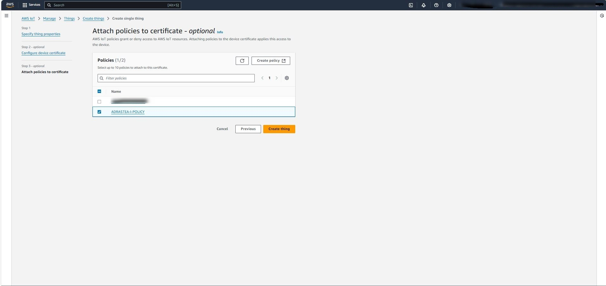
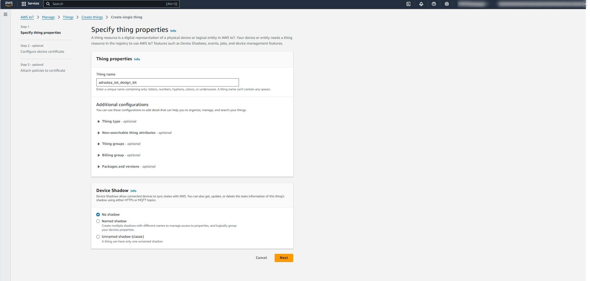
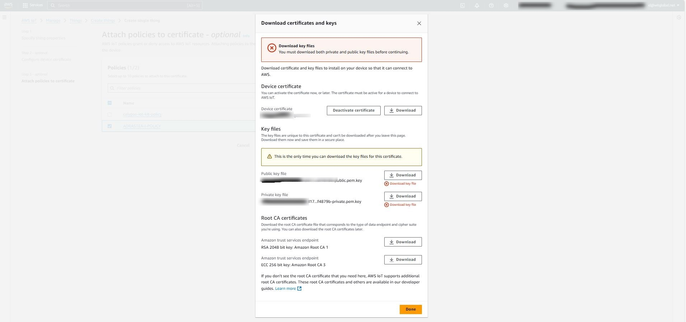
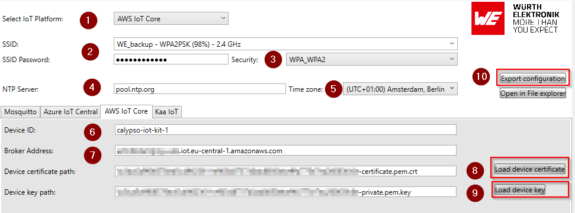
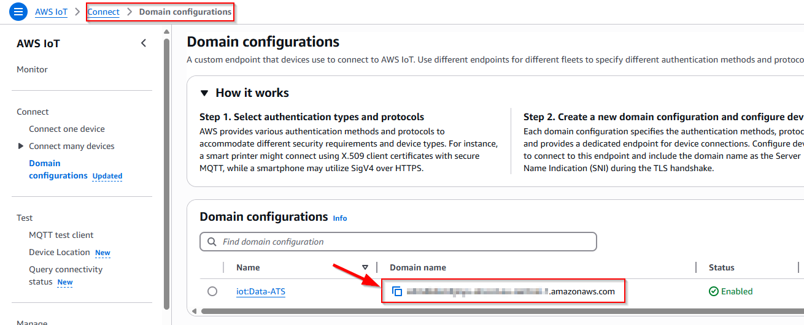
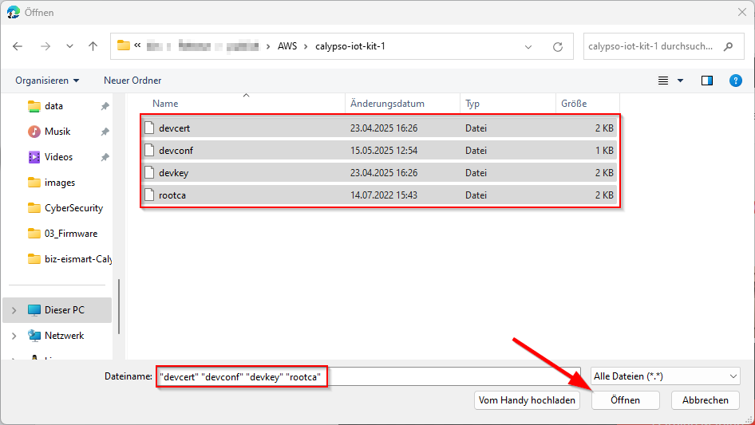
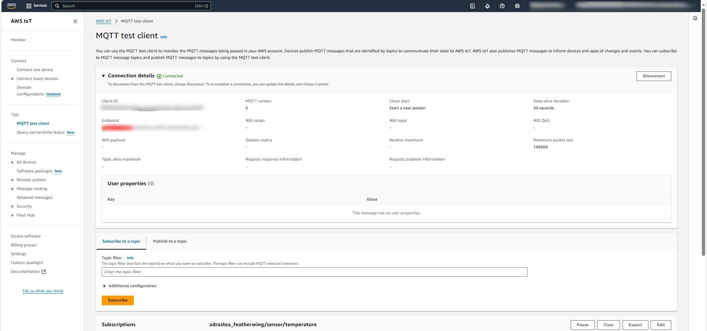

# Quick start guide using AWS IoT Core

AWS IoT provides the cloud services that connect your IoT devices to other devices and AWS cloud services. If your devices can connect to AWS IoT, AWS IoT can connect them to the cloud services that AWS provides.

The AWS IoT Core message broker supports devices and clients that use MQTT and MQTT over WSS protocols to publish and subscribe to messages.

This document will guide you through the process of configuring the AWS IoT core as well as the Calypso IoT design kit and sending sensor data from the kit to AWS.

# AWS IoT Configuration Guide

This guide outlines the necessary steps to create and configure AWS IoT core. Before proceeding, please familiarize yourself with the AWS IoT Core service by visiting the official documentation: [AWS IoT Core](https://aws.amazon.com/iot-core/).

> [!WARNING]  
> Please ensure that you do not share your private keys and certificates with anyone.


## Setup Steps
To configure your IoT core, follow these key steps:

1. **Create an AWS Account**  
2. **Create device**  
3. **Generate and download device certificates**   

>[!WARNING]
> AWS services and interfaces are continuously updated. Refer to [AWS IoT](https://aws.amazon.com/iot/) documentation for the latest details.

## Step 1: Create an AWS Account
To access AWS IoT services, create an AWS account and configure permissions. Follow the official guide for step-by-step instructions:

- [Create and Activate an AWS Account](https://aws.amazon.com/premiumsupport/knowledge-center/create-and-activate-aws-account/)
- [Setting Up AWS IoT](https://docs.aws.amazon.com/iot/latest/developerguide/setting-up.html)


## Step 2: Create device
1. Log in to the AWS Management Console.
2. Navigate to **IoT Core** using the search bar.



3. Under **Manage** -> **All Devices**, select **Things**.



4. Choose **Create things** and click **Next** and select **Create single thing** with policy



and attach the policy below. This AWS IoT policy grants full access to IoT Core operations, including connecting, publishing, receiving, and subscribing to topics. The policy applies to all IoT resources within the AWS account.


**Policy Summary**

This AWS Identity and Access Management (IAM) policy allows the following actions for all IoT resources (`*`):

- **iot:Connect**: Allows the device to connect to the AWS IoT Core service.
- **iot:Publish**: Allows the device to publish messages to AWS IoT topics.
- **iot:Receive**: Allows the device to receive messages from AWS IoT topics.
- **iot:Subscribe**: Allows the device to subscribe to AWS IoT topics.


**Policy JSON**

```json
{
  "Version": "2012-10-17",
  "Statement": [
    {
      "Effect": "Allow",
      "Action": "iot:Connect",
      "Resource": "*"
    },
    {
      "Effect": "Allow",
      "Action": "iot:Publish",
      "Resource": "*"
    },
    {
      "Effect": "Allow",
      "Action": "iot:Receive",
      "Resource": "*"
    },
    {
      "Effect": "Allow",
      "Action": "iot:Subscribe",
      "Resource": "*"
    }
  ]
}
```



5. Provide a unique name for your device (e.g., `calypso-iot-kit-1`).




6. Keep **Device Shadow** set to default (`No shadow`) and proceed.


## Step 3: Generate and download device certificates
1. Select **Auto-generate a new certificate (recommended)** and click **Next**.



2. Download and securely store the generated certificate, public key, and private key.

> [!WARNING] 
> Please ensure that you do not share your private keys and certificates with anyone. The private key can be downloaded just once.


# **Create device configuration files**

In order to connect the device to the AWS IoT core, the device needs to be configured with all the required parameter and certificate files. The WE certificate generator tool helps generate all the necessary files.

- 	Download the WE certificate generator tool from https://www.we-online.com/certificategenerator 

- 	Unzip to a suitable location on the computer and open the executable ```WECertificateUploader.exe```

Inside the WE Certificate Generator tool, fill in the following fields to generate the required certificates for the cloud service



1. Select "AWS IoT core" from the "Select IoT platform" dropdown.

2.	SSID and Password: Select your Wi-Fi network and type in the password. The device will connect to internet through this Wi-Fi network.

3.	Security: Check if the selected security type is correct for the selected Wi-Fi network.

4.	NTP server: If needed change the time server of choice that the module will use to get the current time.

5.	Time zone: Select the appropriate time zone.

6.	Device ID: This is the name of the "thing" created on the AWS IoT Core. It needs to be unique per device. In this example, the name "test-dev" is used.

7.	Broker address: This is the address of the IoT core end-point created in the previous section. You can find the broker address under "Connect -> Domain Configurations" on your IoT core.



8. Device certificate path: Click on "Load device certificate" button, browse to the location where the device certificate downloaded in the previous section is located, select the certificate file.

9. Device key path:  Click on "Load device key" button, browse to the location where the device key downloaded in the previous section is located, select the key file.

10. Finally, use "**Export Configuration**" button to save. The configuration as well as the certificate and key files will be created and stored under "AWS/<device_id>" folder inside the main directory.

# **Configure the device**
          
The IoT design kit comes with the Firmware pre-installed. In this step, a one-time configuration of the kit is done which enables connection to the desired Wi-Fi network and the previously created IoT central application
          
- Ensure that all the four boards are stacked up correctly with the Adafruit FeatherWing OLED on the top.
          
- Power up the IoT design kit stack via USB or a Li-Po connector on the Adafruit M0 Feather board.
          

            
- After a short initialization process, the device waits for the user to start the configuration process. The following message appears on the display "Device not configured. To configure double press button C".
            
- Double press button C on the OLED display FeatherWing to enter the configuration mode.


              
              
- In the configuration mode, perform the following five steps,

  
  
  a. In the configuration mode, the Calypso Wi-Fi module is set to access point mode with an SSID "calypso_<MAC_ADDRESS>" and password "calypsowlan". Connect your PC (Laptop/tablet/smartphone) to this access point, displayed on the screen.

  
 
  b. On the PC open a browser.
              
  c. In the browser, navigate to calypso.net/azure.html.                     

     


  d. Click on the "Choose Files" button. This opens the file browser. Browse to the location where the configuration files were generated as described in the previous section. Select all the files in the directory and click on "Upload" button. On success, the message "Success: 204 No content" at the bottom of the page indicates successful configuration of the device.

 
  e. Restart the device by clicking the "Reset" button.
              

                  
- On restarting, the device goes through the following steps automatically,
              
  a. Initialize the hardware.
              
  b. Connect to the configured Wi-Fi network.
              
  d. Finally, the device connects securely to the IoT core and starts exchange of data.
              
At this stage, the device is fully configured, securely connected and ready to use. On subsequent boot-up the device directly connects to the platform using the saved address and starts exchanging data with the platform.
             
  

Connect the PC to the Internet by reconnect to the your local Wi-Fi network.

**Congratulations!** The set-up is now complete. It's not time to check the telemetry data on the cloud.

# **View sensor data on AWS test client**

1. Open the MQTT Test Client under Test.
2. Subscribe to the "calypso/#".
3. Check data from MQTT test client.

  


# **Send commands to device**

In order to send a command to change the mini neo-pixel LED on the device, Publish to the topic, "calypso/setled" a json payload in the following format.

```json
{
    "red": 255,
    "green": 255,
    "blue": 255
}
```
The message is processed by the device and the color of the LED is changed accordingly.

A few sample colors,

| Color | R | G | B |
| :----------------  | :------: | :------: | :------: |
| Red | 255 | 0 | 0 |
| Green | 0 | 255 | 0 |
| Blue | 0 | 0| 255|
| Yellow | 255 | 255 | 0 |
| White | 255 | 255 | 255 |
| Cyan | 0 | 255 | 255 |


# **Factory resetting the device**

In order to reset the device to factory state, double press "button B". The following message is displayed on the screen, "Reset device to factory state". 
This procedure resets the device to default state. Follow the device configuration process defined earlier to reconfigure the device.