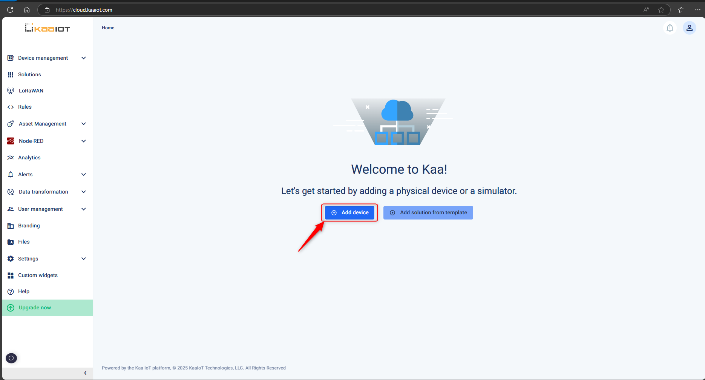
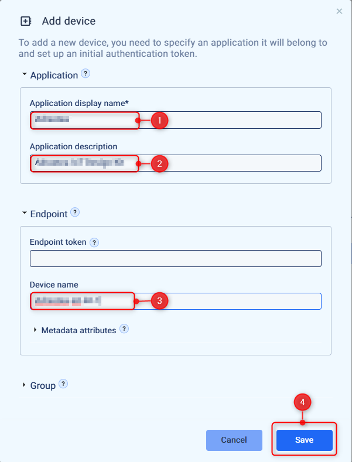
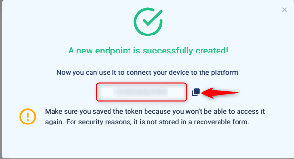
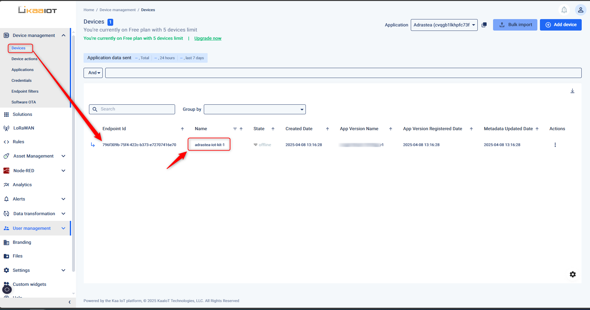
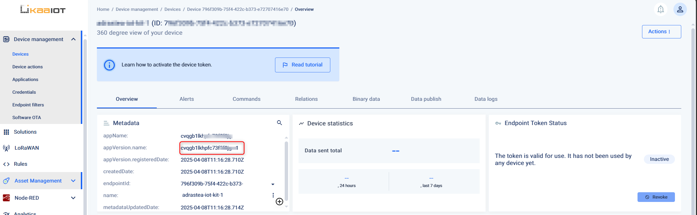
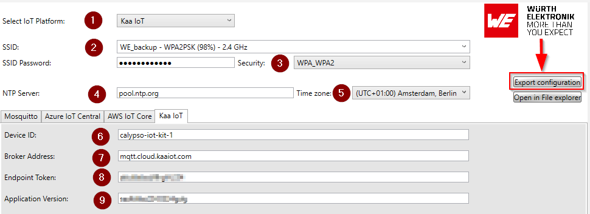
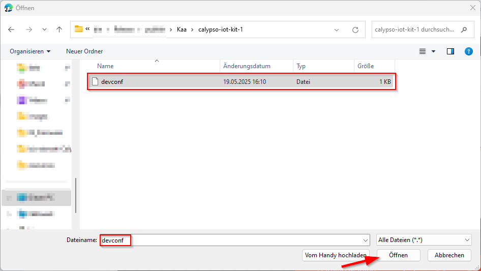
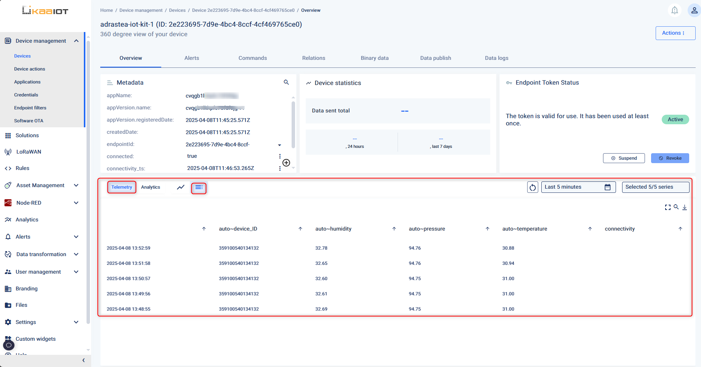
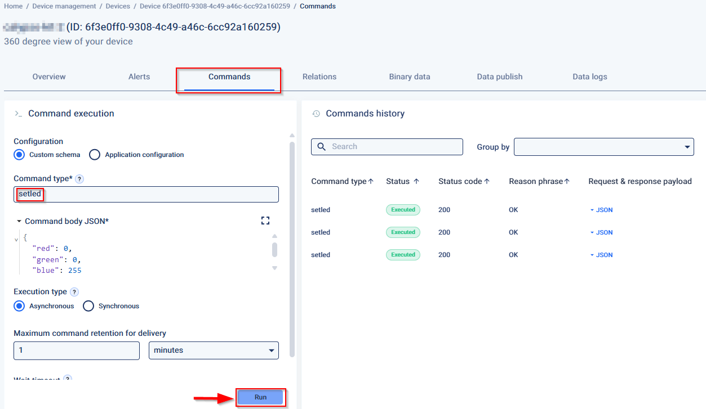

# Quick start guide using Kaa IoT

Kaa is an end-to-end IoT platform applicable for any scale of enterprise IoT projects. It provides a range of features that enable developers to build advanced applications for smart products, flexibly manage their connected devices via the cloud, orchestrate end-to-end data processing, analyze device telemetry, and many more. With the IoT features provided out of the box by Kaa, you can create your IoT applications up to 10 times faster than before.

This document will guide you through the process of configuring the Kaa IoT as well as the Adrastea-I FeatherWing kit and sending sensor data from the kit to Kaa.

# Kaa IoT Configuration Guide

This guide outlines the necessary steps to create and configure Kaa IoT Platform. Before proceeding, please familiarize yourself with the Kaa IoT platform by visiting the [official documentation page.](https://www.kaaiot.com/docs).

> [!WARNING] 
> Please ensure that you do not share your private keys and certificates with anyone.

## Setup Steps
To configure your Kaa IoT, follow these key steps:

1. **Create an Kaa IoT Account**  
2. **Create application and device**

## Step 1: Create an free trial account

Kaa IoT offers a free trial account that can be used for testing. Click [here](https://www.kaaiot.com/free-trial) and follow the instructions on the page to create your free account.

## Step 2: Create application and device

Once you login to your Kaa IoT account, click on "Add device" button in the home page.



In the pop-up, enter the following details:

- Application display name
- Application description
- Device name

And click on "Save". This will create a new device.



 In the pop-up, an endpoint toke will be generated. Please make sure to copy and save this token.



You can view the device created by click on "Device management" -> "<Your_device_name>"




In the device overview page copy the "appVersion.name" string.




# **Create device configuration files**

In order to connect the device to the Kaa IoT platform, the device needs to be configured with all the required parameter. The WE certificate generator tool helps generate all the necessary files.

- 	Download the WE certificate generator tool from https://www.we-online.com/certificategenerator 

- 	Unzip to a suitable location on the computer and open the executable ```WECertificateUploader.exe```

Inside the WE Certificate Generator tool, fill in the following fields to generate the required certificates for the cloud service



1. Select "Kaa IoT" from the "Select IoT platform" dropdown.

2.	SSID and Password: Select your Wi-Fi network and type in the password. The device will connect to internet through this Wi-Fi network.

3.	Security: Check if the selected security type is correct for the selected Wi-Fi network.

4.	NTP server: If needed change the time server of choice that the module will use to get the current time.

5.	Time zone: Select the appropriate time zone.

6.	Device ID: This is the name of the device created in the previous section.

7.	Broker address: This is the address of the Kaa IoT core end-point. Use the default value "mqtt.cloud.kaaiot.com"

8. End point token: This is the token generated while creating the device in the previous section.

9. Application version:  Copy this value from the device page of the Kaa IoT platform.

10. Finally, use "**Export Configuration**" button to save. The configuration as well as the certificate and key files will be created and stored under "Kaa/<device_id>" folder inside the main directory.

# **Configure the device**
          
The IoT design kit comes with the Firmware pre-installed. In this step, a one-time configuration of the kit is done which enables connection to the desired Wi-Fi network and the previously created IoT central application
          
- Ensure that all the four boards are stacked up correctly with the Adafruit FeatherWing OLED on the top.
          
- Power up the IoT design kit stack via USB or a Li-Po connector on the Adafruit M0 Feather board.
          

            
- After a short initialization process, the device waits for the user to start the configuration process. The following message appears on the display "Device not configured. To configure double press button C".
            
- Double press button C on the OLED display FeatherWing to enter the configuration mode.


              
              
- In the configuration mode, perform the following five steps,

  
  
  a. In the configuration mode, the Calypso Wi-Fi module is set to access point mode with an SSID "calypso_<MAC_ADDRESS>" and password "calypsowlan". Connect your PC (Laptop/tablet/smartphone) to this access point, displayed on the screen.

  
 
  b. On the PC open a browser.
              
  c. In the browser, navigate to calypso.net/azure.html.                     

     


  d. Click on the "Choose Files" button. This opens the file browser. Browse to the location where the configuration files were generated as described in the previous section. Select all the files in the directory and click on "Upload" button. On success, the message "Success: 204 No content" at the bottom of the page indicates successful configuration of the device.

 
  e. Restart the device by clicking the "Reset" button.
              

                  
- On restarting, the device goes through the following steps automatically,
              
  a. Initialize the hardware.
              
  b. Connect to the configured Wi-Fi network.
              
  d. Finally, the device connects securely to the IoT core and starts exchange of data.
              
At this stage, the device is fully configured, securely connected and ready to use. On subsequent boot-up the device directly connects to the platform using the saved address and starts exchanging data with the platform.
             
  

Connect the PC to the Internet by reconnect to the your local Wi-Fi network.

**Congratulations!** The set-up is now complete. It's not time to check the telemetry data on the cloud.

# **View sensor data on Kaa IoT**
Open the device page by clicking click on "Device management" -> "<Your_device_name>"

  


You can view the telemetry data at the bottom of the device page.
  

# **Send commands to device**
  
In order to send a command to change the mini neo-pixel LED on the device, go to "Commands" tab in the device page.

1. Enter "setled" in the command type.
2. Create a JSON with the desired value in the "Command body JSON" text box. For example,

```json
{
    "red": 0,
    "green": 0,
    "blue": 255
}
```
3. Finally click "Run" to execute the command.

The message is processed by the device and the color of the LED is changed accordingly.
  


A few sample colors,

| Color | R | G | B |
| :----------------  | :------: | :------: | :------: |
| Red | 255 | 0 | 0 |
| Green | 0 | 255 | 0 |
| Blue | 0 | 0| 255|
| Yellow | 255 | 255 | 0 |
| White | 255 | 255 | 255 |
| Cyan | 0 | 255 | 255 |


# **Factory resetting the device**

In order to reset the device to factory state, double press "button B". The following message is displayed on the screen, "Reset device to factory state". 
This procedure resets the device to default state. Follow the device configuration process defined earlier to reconfigure the device.