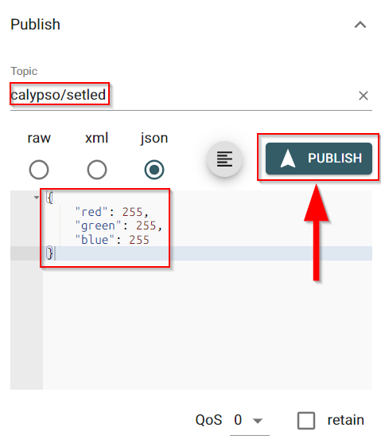

# Quick start guide using Eclipse Mosquitto broker
[Eclipse Mosquitto](https://mosquitto.org/) is an open source (EPL/EDL licensed) message broker that currently implements the MQTT protocol versions 5.0, 3.1.1 and 3.1. Mosquitto is lightweight and is suitable for use on all devices from low power single board computers to full servers.

[test.mosquitto.org](https://test.mosquitto.org/) is a publicly available Eclipse Mosquitto MQTT server/broker. [This server](https://test.mosquitto.org/) is provided as a service for the community and is extremely useful for testing.

We will connect the Adrastea-I FeatherWing kit to this publicly available broker.

> [!WARNING]  
> **The MQTT server used here is public and data sent will be publicly accessible. Be aware of the data you share.**


This document will guide you through the process of configuring Calypso IoT design kit and sending sensor data from the kit to cloud. This process involves the following steps at the end of which you should be able to see the telemetry data from the device graphically represented on the "MQTT explorer" tool.

Each of these steps are described in detail in the subsequent sections.

[**1. Create device config files:**](#create-device-configuration-files) In this step all the files that are necessary to configure a device and the IoT platform are created.

[**2. Configure the device:**](#configure-the-device) This step fully configures the device to connect to cloud.

[**3. Interact with the device on the cloud:**](#view-the-data-on-mqtt-explorer) View device dashboard and interact with the device from the cloud platform.

# **Create device configuration files**

In order to connect the device to the Mosquitto broker, the device needs to be configured with all the required parameter and certificate files. The WE certificate generator tool helps generate all the necessary files.

- 	Download the WE certificate generator tool from https://www.we-online.com/certificategenerator 

- 	Unzip to a suitable location on the computer and open the executable ```WECertificateUploader.exe```

In addition to this, this process requires the root CA certificate of the Mosquitto broker for server authentication during the TLS handshake. Please download the certificate from this [link](https://test.mosquitto.org/ssl/mosquitto.org.crt).

Inside the WE Certificate Generator tool, fill in the following fields to generate the required certificates for the cloud service


1. Select "Mosquitto MQTT" from the "Select IoT platform" dropdown.

2. SSID and Password: Select your Wi-Fi network and type in the password. The device will connect to internet through this Wi-Fi network.

3. Security: Check if the selected security type is correct for the selected Wi-Fi network.

4. NTP server: If needed change the time server of choice that the module will use to get the current time.

5. Time zone: Select the appropriate time zone.

6. Device ID: This is the name of the device that uniquely identified it. In this example, the name "test-dev" is used.

7. Broker address: This is the address to the mosquitto broker. When using the public broker, this will be "test.mosquitto.org"

8. Root CA certificate: Use the "Load RootCA Cert" button to browse to the location where you have stored the root CA certificate of the Mosquitto broker and select this file.


Finally, use "**Export Configuration**" button to save. The configuration as well as the certificate file will be created and stored under "Mosquitto/<device_id>" folder inside the main directory.

    
# **Configure the device**
          
The IoT design kit comes with the Firmware pre-installed. In this step, a one-time configuration of the kit is done which enables connection to the desired Wi-Fi network and the Mosquitto broker.
          
- Ensure that all the four boards are stacked up correctly with the Adafruit FeatherWing OLED on the top.
          
- Power up the IoT design kit stack via USB or a Li-Po connector on the Adafruit M0 Feather board.
          

            
- After a short initialization process, the device waits for the user to start the configuration process. The following message appears on the display "Device not configured. To configure double press button C".
            
- Double press button C on the OLED display FeatherWing to enter the configuration mode.


              
              
- In the configuration mode, perform the following five steps,

  
  
  a. In the configuration mode, the Calypso Wi-Fi module is set to access point mode with an SSID "calypso_<MAC_ADDRESS>" and password "calypsowlan". Connect your PC (Laptop/tablet/smartphone) to this access point, displayed on the screen.

  
 
  b. On the PC open a browser. Make sure that you are not connected to any other network (for example via LAN) and the use of proxy server is disabled.
              
  c. In the browser, navigate to calypso.net/azure.html.                     

     


  d. Click on the "Choose Files" button. This opens the file browser. Browse to the location where the configuration files were generated as described in the previous section. Select all the files in the directory and click on "Upload" button. On success, the message "Success: 204 No content" at the bottom of the page indicates successful configuration of the device.

 
  e. Restart the device by clicking the "Reset" button.
              

                  
- On restarting, the device goes through the following steps automatically,
              
  a. Initialize the hardware.
              
  b. Connect to the configured Wi-Fi network
              
  c. Finally, the device connects securely to the Mosquitto broker and starts exchange of data.
              
At this stage, the device is fully configured, securely connected and ready to use. On subsequent boot-up the device directly connects to the platform using the saved address and starts exchanging data with the platform.
             
  

Connect the PC to the Internet by reconnect to the your local Wi-Fi network.

**Congratulations!** The set-up is now complete. It's not time to check the telemetry data on the cloud.


# View the data on MQTT Explorer

MQTT explorer is a MQTT client available on multiple platforms. 
It is a comprehensive MQTT client that provides a structured overview of your MQTT topics and makes working with devices/services on your broker dead-simple.

[Download](https://mqtt-explorer.com/) and install the same.

Next, we will connect to the Mosquitto broker over TCP. In this case the connection is neither mutually authenticated nor encrypted.

## Connect MQTT Explorer to Mosquitto broker

Open the MQTT explorer tool. In the start-up page add the parameters of the MQTT broker/server.

1. Click on the "+ connections" button.
2. Give a unique name to this connection. For example, "mosquitto".
3. Enter the host name. This is the address of the MQTT broker/server "test.mosquitto.org"
4. Click on advance button.
In the advanced view,
5. Delete the default topic "#" in order to prevent receiving all messages published to this public server.
6. Delete the default topic "$SYS/#"
7. Type in a new topic name "calypso/#". 
8. Click on add to subscribe to this topic by default on successful connection.
9. Click on "BACK" button to return to the default view.
10. Finally, click on the "CONNECT" button to connect to the broker.


## Visualize data on the MQTT explorer

Once connected, you will see the data published by the kit in the data view.
Click on the topic and the subtopic to see the JSON payload in the "value section".
You can click on the "Add to chart" symbol to view the data graphically.


## **Send commands to device**
  
In order to send a command to change the mini neo-pixel LED on the device, Publish to the topic, "calypso/setled" a json payload in the following format.

```json
{
    "red": 255,
    "green": 255,
    "blue": 255
}
```
The message is processed by the device and the color of the LED is changed accordingly.
  


A few sample colors,

| Color | R | G | B |
| :----------------  | :------: | :------: | :------: |
| Red | 255 | 0 | 0 |
| Green | 0 | 255 | 0 |
| Blue | 0 | 0| 255|
| Yellow | 255 | 255 | 0 |
| White | 255 | 255 | 255 |
| Cyan | 0 | 255 | 255 |


# **Factory resetting the device**

In order to reset the device to factory state, double press "button B". The following message is displayed on the screen, "Reset device to factory state". 
This procedure resets the device to default state. Follow the device configuration process defined earlier to reconfigure the device.